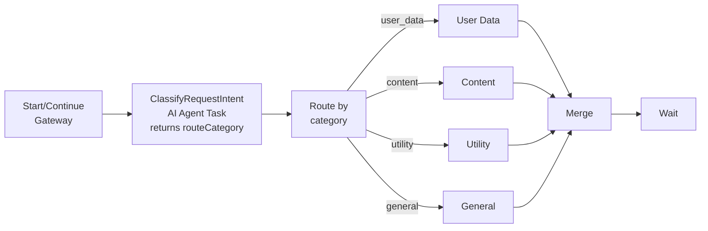
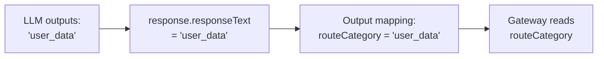

# Replace ClassifyRequest with AI Agent Task (Pure Classifier, No Tools)

## Design: Zero-Tool Classification

One BPMN element replaced. No tools. No subprocess. Just an LLM call that returns the category directly.



**What stays unchanged**: gateway, 4 call activities, per-agent contexts, boundary errors, merge/error gateways, backend, frontend.

---

## Why No Tools?

For simple classification where the LLM just outputs a category name, tools add unnecessary overhead:

- **With tools**: LLM generates tool call → Camunda executes tool → LLM receives result → LLM confirms
- **Without tools**: LLM generates category name directly → Done

The system prompt instructs the LLM to output ONLY the category name. The output is captured in `response.responseText` and mapped to `routeCategory`.

---

## BPMN Changes -- [main-chat-router.bpmn](files/main-chat-router.bpmn)

### Replace

- **Old**: `ClassifyRequest` script task (FEEL expression)
- **New**: `ClassifyRequestIntent` service task (AI Agent Task)

**ClassifyRequestIntent -- AI Agent Task (Service Task)**

- ID: `ClassifyRequestIntent`
- Name: "Classify Request Intent"
- Template: `Template_03bz1id` v1
- Task definition: `io.camunda.agenticai:aiagent:1`

**System prompt** (minimal -- instructs LLM to output category only):

```
You are a request classifier. Analyse the user's request and respond with ONLY one of these exact category names: user_data, content, utility, or general.

Categories:
- user_data: users, people, contacts, profiles, emails, phones, accounts, members, customers
- content: recipes, cooking, food, ingredients, dishes, cuisine, jokes, humour, entertainment
- utility: current date/time, superflux calculations, math operations, URLs, websites, web content
- general: everything else (math, science, history, geography, coding, explanations, creative writing, etc.)

Rules:
1. Respond with ONLY the category name, nothing else.
2. If ambiguous or spans multiple domains, choose the MOST relevant. When unclear, prefer general.
3. Do not answer the user's question. Only output the category.
```

**IO mappings (inputs):**

```
=providerConfig.type                             -> provider.type
=providerConfig.region                           -> provider.bedrock.region
=providerConfig.authType                         -> provider.bedrock.authentication.type
{{secrets.AWS_BEDROCK_ACCESS_KEY}}               -> provider.bedrock.authentication.accessKey
{{secrets.AWS_BEDROCK_SECRET_KEY}}               -> provider.bedrock.authentication.secretKey
=providerConfig.model                            -> provider.bedrock.model.model
(system prompt above)                            -> data.systemPrompt.prompt
=if followUpInput defined then followUpInput     -> data.userPrompt.prompt
  else inputText
=if classifierAgentCtx defined then              -> data.agentContext
  classifierAgentCtx else null
=1                                               -> data.limits.maxModelCalls
="text"                                          -> data.response.format.type
=false                                           -> data.response.format.parseJson
```

**IO mappings (outputs):**

```
=response.responseText   -> routeCategory          (LLM output is the category name)
=response.agentContext   -> classifierAgentCtx     (persist classifier memory across turns)
```

**Variable flow:**



---

### Sequence Flow Changes

2 attribute edits, no structural changes:

- `Flow_to_classifier`: `targetRef` `ClassifyRequest` → `ClassifyRequestIntent`
- `Flow_to_route`: `sourceRef` `ClassifyRequest` → `ClassifyRequestIntent`

### BPMNDI

- Replace `ClassifyRequest_di` shape with `ClassifyRequestIntent_di` (service task, not expanded subprocess)
- Position: `x="370" y="320" width="100" height="80"`

---

## Context Memory

**Added**: `classifierAgentCtx` -- lightweight routing memory. Lets the classifier handle "tell me more" / "another one" by remembering which category it last routed to.

**Removed**: `currentInput` -- the AI agent reads the user prompt directly.

**Unchanged**: `routeCategory`, `agent`, all per-subagent contexts, `providerConfig`, `sessionId`, `inputText`, `followUpInput`.

---

## Backend Changes -- [CamundaChatService.java](Backend/src/main/java/com/example/aichat/service/CamundaChatService.java)

**None.** The process variable contract is identical:

- `routeCategory` still set (by AI Agent output instead of FEEL keywords)
- `agent.responseText` still set (by downstream subagent, exactly as before)
- `AGENT_LABELS`, `resolveAgentLabel()`, `extractRouteCategory()` -- all unchanged
- `handledBy` still shows domain-specific labels (e.g., "User Data Agent")

---

## Frontend Changes

**None.**

---

## Child Agent BPMNs

**No changes.** All 4 agent processes untouched.

---

## Performance

- **Added latency**: ~1-2s for one lightweight LLM call (tiny prompt, no tool execution, no context)
- **Token budget per classification**: ~150 input tokens (system prompt + user message) + ~10 output tokens (just the category name). Negligible cost.
- **maxModelCalls = 1**: Classifier resolves in exactly 1 model call. No tools, no feedback loop.
- **No context window**: Classifier doesn't need conversation history for classification (each request is independent).

---

## Risk

**Minimal.** Service task with AI Agent connector is the simplest possible pattern. No tools, no subprocess, no feedback loop. The LLM just outputs a category name. If it outputs something invalid (e.g., "I'm not sure"), the gateway will default to `general` via the default flow.

---

## DOCUMENTATION.md

- **3.3**: Replace ClassifyRequest row -- type "AI Agent Task (Service Task)", purpose "AI-powered intent classification via LLM; returns routeCategory directly in response.responseText (no tools)"
- **3.5**: Add `classifierAgentCtx` variable. Remove `currentInput`.

---

## Implementation Complete

All changes have been implemented:

1. ✅ `main-chat-router.bpmn`: Replaced `ClassifyRequest` script task with `ClassifyRequestIntent` AI Agent Task (service task, no tools)
2. ✅ `DOCUMENTATION.md`: Updated section 3.3 to reflect the new AI Agent Task implementation
3. ✅ Process version bumped to 1.1 in BPMN

The implementation is ready for deployment and testing.
