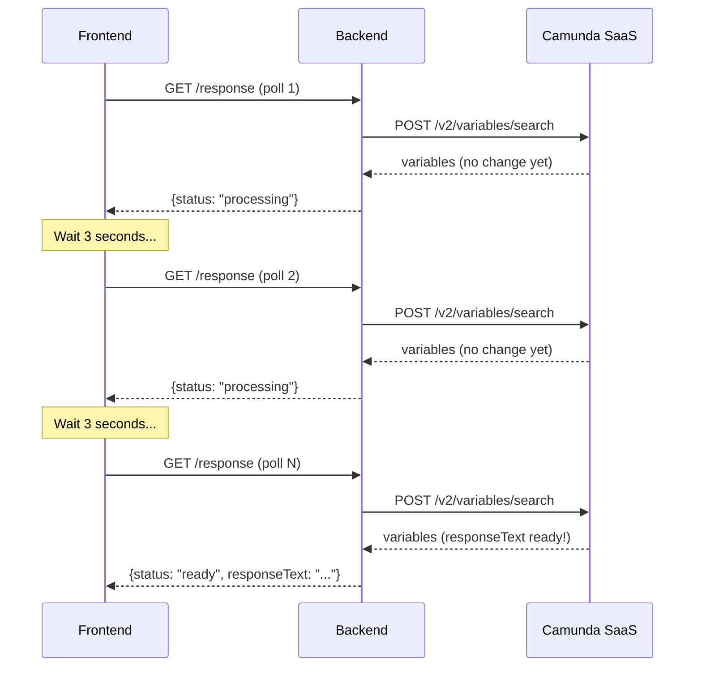
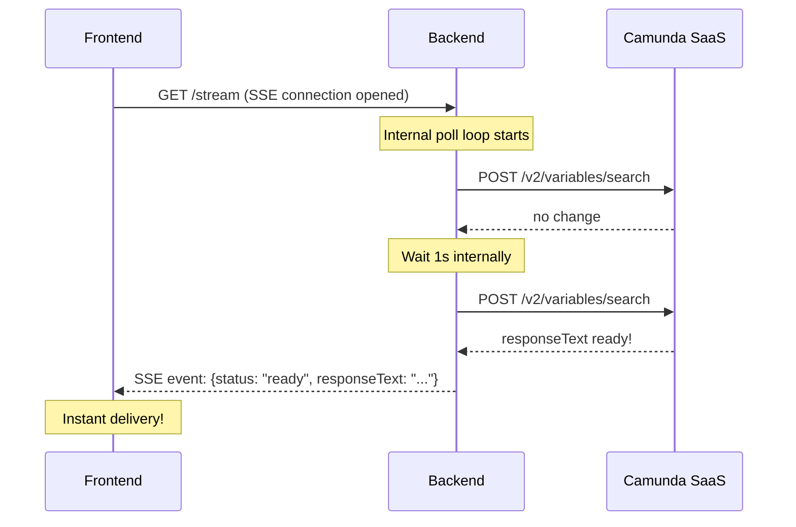
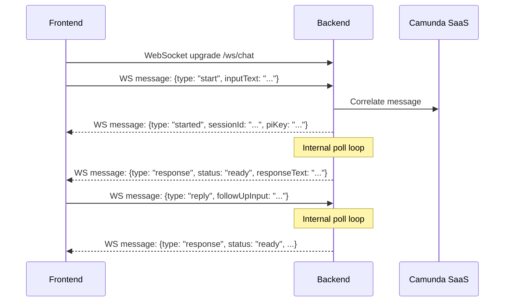
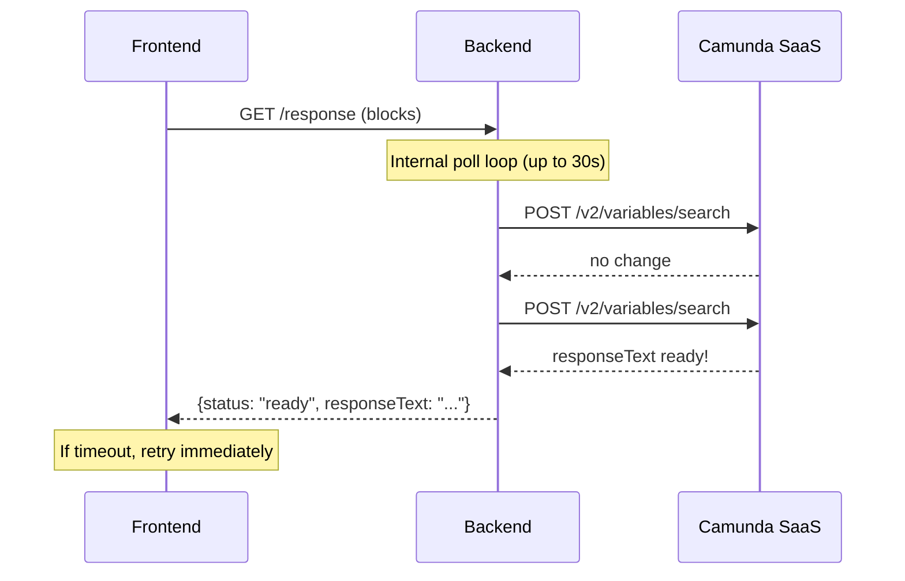
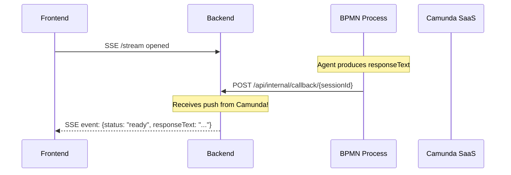

# High-Performance Alternatives to Frontend Polling

## Current Mechanism and Its Costs

The frontend polls `GET /api/chat/{sessionId}/response` every **3 seconds** (`POLL_INTERVAL = 3000`) up to **200 times** (10 minutes). Each poll triggers a backend call to Camunda's `POST /v2/variables/search` API.




**Problems:**

- **Latency**: Up to 3 seconds between the process completing and the user seeing the response
- **Wasted requests**: Every "processing" response is a round-trip to Camunda SaaS for nothing
- **Scaling**: N concurrent users = N * (polls/sec) requests to Camunda, which can hit rate limits

**Fundamental constraint**: Camunda 8 SaaS provides no push/webhook mechanism to notify the backend when a process variable changes. The backend *must* check Camunda for variable updates. The question is where and how that checking happens.

---

## Option 1: Server-Sent Events (SSE) -- RECOMMENDED

**Concept**: The backend holds an open HTTP connection and pushes events to the frontend the instant data is ready. The backend still polls Camunda internally, but at a tighter interval (e.g. 1s), and the frontend receives the result with zero additional latency.




**Why this is the best fit:**

- The `spring-boot-starter-web` (already used) has native `SseEmitter` support -- zero new dependencies
- The browser's `EventSource` API works natively -- zero new frontend dependencies
- The 3-second client polling latency drops to near-zero (limited only by the ~1s internal poll)
- The internal poll interval can be tuned independently (e.g. 500ms server-to-Camunda vs. 3s client-to-server)
- The total number of Camunda API calls stays the same or decreases (you can deduplicate: one internal poll loop per session, not one per client request)
- Session expiry, error handling, and the entire `ChatResponseDTO` contract stay unchanged
- CORS config in [WebConfig.java](Backend/src/main/java/com/example/aichat/config/WebConfig.java) already covers `/api/`**

**Backend changes:**

1. **New SSE endpoint** in [ChatController.java](Backend/src/main/java/com/example/aichat/controller/ChatController.java):

```java
@GetMapping("/{sessionId}/stream")
public SseEmitter streamResponse(@PathVariable String sessionId) {
    return chatService.streamResponse(sessionId);
}
```

1. **New `streamResponse()` method** in [CamundaChatService.java](Backend/src/main/java/com/example/aichat/service/CamundaChatService.java): Creates an `SseEmitter` (timeout 10 min), starts a `ScheduledExecutorService` that polls Camunda every ~1s, sends SSE events when status changes, completes the emitter when "ready" or "error" is detected.
2. The existing `GET /{sessionId}/response` endpoint can remain as a fallback.

**Frontend changes:**

1. Replace the `setTimeout`-based poll loop in [ChatWindow.jsx](Frontend/src/components/ChatWindow.jsx) with an `EventSource`:

```javascript
const es = new EventSource(`${API_BASE}/${sid}/stream`);
es.onmessage = (event) => {
    const data = JSON.parse(event.data);
    if (data.status === 'ready') { /* show response, close stream */ }
};
```

1. Remove `POLL_INTERVAL`, `MAX_POLL_ATTEMPTS`, `schedulePoll`, `pollTimeoutRef`, `pollCountRef` -- replaced by the single `EventSource`.

**Estimated changes**: ~60 lines backend, ~40 lines frontend (net reduction due to removing poll machinery).

---

## Option 2: WebSocket

**Concept**: A persistent bi-directional channel between frontend and backend. Could unify all three operations (start, reply, stream response) into a single WebSocket connection per session.




**Pros:**

- True bi-directional -- could replace REST endpoints entirely for the chat flow
- Single connection per session (lower overhead than SSE + REST)
- Can push multiple event types (partial progress, typing indicators, etc.)

**Cons:**

- Requires adding `spring-boot-starter-websocket` dependency
- New WebSocket handler/config class, message frame protocol, reconnection logic
- The frontend needs manual WebSocket management (no native `EventSource` simplicity)
- CORS for WebSocket is configured differently than HTTP
- The existing REST API (used for start/reply) would need to be maintained alongside or fully replaced
- Significantly more code than SSE (~150+ lines backend, ~80+ lines frontend)

**Verdict**: Overkill for this use case. The only server-to-client push needed is the response stream. Start and reply are natural request/response operations. WebSocket shines in chat apps where both sides send frequent messages -- here the user sends one message and waits for one response.

---

## Option 3: HTTP Long Polling

**Concept**: The `GET /{sessionId}/response` endpoint blocks until the response is ready (or a timeout expires), rather than returning "processing" immediately.




**Pros:**

- Minimal frontend change -- just increase `REQUEST_TIMEOUT_MS` and reduce `POLL_INTERVAL` to near-zero
- Backend can use `DeferredResult<ChatResponseDTO>` (Spring MVC async) to avoid blocking a thread
- No new protocol, no new dependency

**Cons:**

- Intermediate proxy/load balancer timeouts can silently kill long-held connections
- The frontend must still handle timeout-and-retry, so the polling code doesn't go away entirely
- Less responsive than SSE (each response cycle requires a new HTTP request)
- Harder to send intermediate status updates (e.g. "routed to Content Agent, waiting for response...")

**Verdict**: A simpler incremental improvement over the current approach, but SSE is strictly better for this use case.

---

## Option 4 (Bonus): BPMN Callback + SSE (Zero-polling)

**Concept**: Add a REST outbound connector task in the BPMN process that calls back to the backend when the agent response is ready. Combined with SSE, this eliminates ALL polling -- even the backend-to-Camunda polling.




**Pros:**

- True zero-polling end-to-end -- most efficient possible
- Backend does not call Camunda API at all for response retrieval

**Cons:**

- Backend must be publicly reachable from Camunda SaaS (or use a tunnel/ngrok for local dev)
- Requires BPMN changes (add a REST connector task after each agent subprocess)
- Security: the callback endpoint needs authentication to prevent spoofing
- More complex failure handling (what if the callback fails?)

**Verdict**: The ultimate solution for production at scale, but requires more architectural changes. Could be a Phase 2 improvement after SSE is in place.

---

## Recommendation Summary


| Approach                | Latency   | Backend Complexity | Frontend Complexity        | New Dependencies                | Camunda API Calls         |
| ----------------------- | --------- | ------------------ | -------------------------- | ------------------------------- | ------------------------- |
| **Current polling**     | up to 3s  | Low (existing)     | Low (existing)             | None                            | High (every 3s per user)  |
| **SSE (recommended)**   | near-zero | Medium             | Low (simpler than current) | None                            | Same (server-side poll)   |
| **WebSocket**           | near-zero | High               | Medium                     | `spring-boot-starter-websocket` | Same                      |
| **HTTP Long Polling**   | low       | Medium             | Low                        | None                            | Lower (fewer round-trips) |
| **BPMN Callback + SSE** | zero      | High               | Low                        | None                            | Zero for response reads   |


**Recommended approach: SSE (Option 1)**. It delivers the biggest improvement with the least disruption -- no new dependencies, native browser support, and the frontend actually gets simpler (remove the poll loop, replace with `EventSource`).