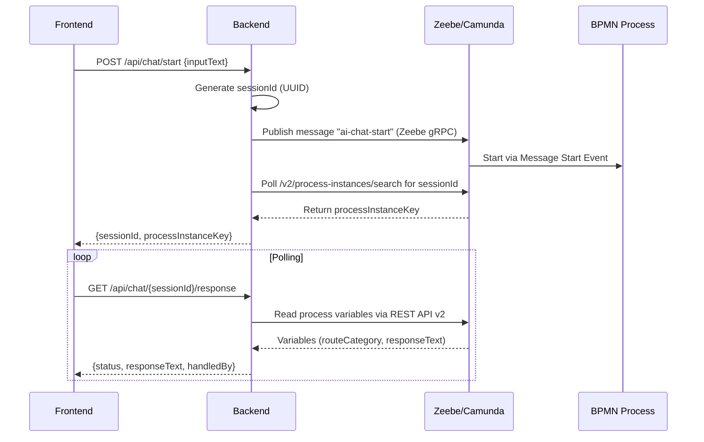
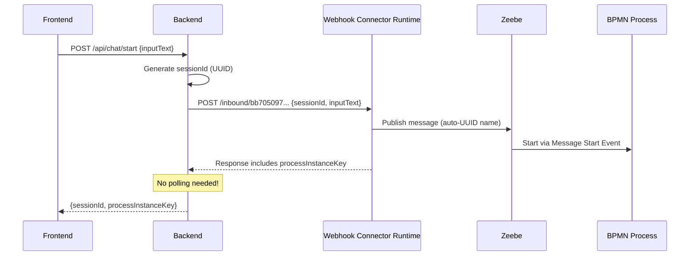
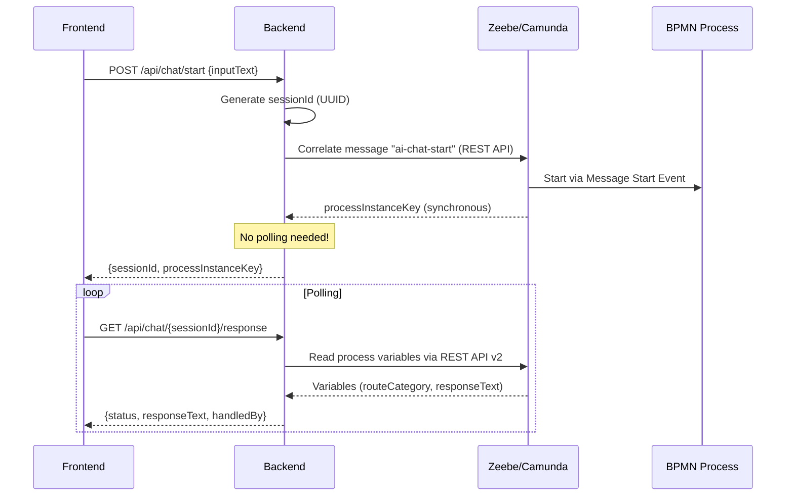

# Webhook Connector Applicability Analysis

## Current Architecture

The system currently starts processes via **Zeebe gRPC messages** published from the Spring Boot backend:




Key files:

- [Backend/src/main/java/com/example/aichat/service/CamundaChatService.java](Backend/src/main/java/com/example/aichat/service/CamundaChatService.java) - Publishes `ai-chat-start` message, polls for process instance, manages sessions
- [Backend/src/main/java/com/example/aichat/service/MessagePublisher.java](Backend/src/main/java/com/example/aichat/service/MessagePublisher.java) - Zeebe `CamundaClient.newPublishMessageCommand()`
- [files/main-chat-router.bpmn](files/main-chat-router.bpmn) - Message Start Event consuming `ai-chat-start`

## The Webhook Element Template

The file [Webhook Message Start Event Connector.json](Webhook Message Start Event Connector.json) is a valid **Zeebe element template** (643 lines) that would be applied to a BPMN Start Event inside the Camunda Modeler. Here is a breakdown of what it defines:

**Identity and Scope**

- Template ID: `Template_0jg1r3c`, type: `io.camunda:webhook:1`
- Applies to `bpmn:StartEvent` with `bpmn:MessageEventDefinition` -- this is specifically a **Message Start Event** variant
- Requires Camunda engine `^8.3`

**Webhook Configuration (groups in the template)**


| Group            | Key Properties                                                                                    | Current Defaults                                            |
| ---------------- | ------------------------------------------------------------------------------------------------- | ----------------------------------------------------------- |
| Webhook config   | `inbound.method` = `any`, `inbound.context` (Webhook ID) = `bb705097-5b34-4388-bcec-728276ba8e55` | Accepts any HTTP method; UUID-based webhook path            |
| Authentication   | `inbound.shouldValidateHmac` = `disabled`                                                         | HMAC off; supports SHA-1/256/512 if enabled                 |
| Authorization    | `inbound.auth.type` = `NONE`                                                                      | Supports None, Basic, API Key, JWT                          |
| Webhook response | `inbound.responseExpression`, `inbound.verificationExpression`                                    | Both blank (returns default Camunda response)               |
| Activation       | `activationCondition` = blank, `consumeUnmatchedEvents` = false                                   | Triggers on every call; rejects unmatched events            |
| Correlation      | `correlationRequired` = `notRequired`, `messageIdExpression` = blank, `messageTtl` = blank        | No subprocess correlation; auto-generated UUID message name |
| Deduplication    | `deduplicationModeManualFlag` = false                                                             | Automatic deduplication                                     |
| Output mapping   | `resultVariable`, `resultExpression`                                                              | Both blank (no variable mapping configured)                 |


**Critical detail**: The template auto-generates a UUID-based message name (`messageNameUuid` with `generatedValue.type: "uuid"`). This **replaces** the current `ai-chat-start` message name with a random UUID managed internally by the connector. The backend's `MessagePublisher.publish("ai-chat-start", ...)` would no longer match.

**How it would work on deployment:**

1. Apply this template to the `StartEvent_ChatSessionStarted` in [files/main-chat-router.bpmn](files/main-chat-router.bpmn)
2. The message name changes from `ai-chat-start` to an auto-generated UUID
3. Camunda generates a public webhook URL: `https://<region>.connectors.camunda.io/<cluster-id>/inbound/bb705097-5b34-4388-bcec-728276ba8e55`
4. POSTing JSON to that URL starts the process; the response includes `processInstanceKey`
5. The `resultExpression` (currently blank) would need to be configured to map `request.body.inputText`, `request.body.sessionId`, etc. into process variables

## How the HTTP Webhook Connector Works (Camunda SaaS docs)

From the [official documentation](https://docs.camunda.io/docs/components/connectors/out-of-the-box-connectors/http-webhook/):

- On deployment, the webhook becomes publicly available at `https://<region>.connectors.camunda.io/<cluster-id>/inbound/<webhook-id>`
- Incoming HTTP requests are matched against the activation condition
- The request payload is available as `request.body`, headers as `request.headers`, query params as `request.params`
- FEEL `resultExpression` maps request data into BPMN process variables
- FEEL `responseExpression` customizes the HTTP response sent back to the caller
- For Message Start Events, the `messageIdExpression` enables deduplication (Zeebe guarantees message uniqueness)
- Supports HMAC, Basic, API Key, and JWT authentication out of the box

## Applicability Assessment

### What the Webhook Connector COULD replace

It could replace the **process start mechanism only** -- instead of publishing a Zeebe message via gRPC, the backend would POST to the webhook URL. The key benefit: the webhook response **directly returns the `processInstanceKey`**, which would eliminate the current polling loop in `CamundaChatService.findProcessInstanceKey()` (20 attempts x 1.5s delay).




Potential changes to the backend if this approach were adopted:

- Replace `MessagePublisher.publish("ai-chat-start", ...)` with an HTTP POST to the webhook URL
- Remove `findProcessInstanceKey()` polling logic (the webhook response includes `processInstanceKey`)
- Configure `resultExpression` in the template to map: `={sessionId: request.body.sessionId, inputText: request.body.inputText, inputDocuments: request.body.inputDocuments}`
- Store the webhook URL (with cluster-specific prefix) as a new config property

### What the Webhook Connector CANNOT replace

The backend performs several critical functions beyond starting the process that the webhook does not cover:

1. **Session management** -- Generating `sessionId`, storing `SessionState` in `SessionRepository`, expiry/cleanup
2. **Response polling** -- Reading process variables (`routeCategory`, `agent.responseText`) via Camunda REST API v2
3. **Follow-up message correlation** -- The `ai-chat-user-reply` intermediate catch event still requires Zeebe gRPC message publishing (the webhook template only applies to Start Events, not intermediate events)
4. **Error handling** -- `ProcessStartException`, `SessionNotFoundException`, `SessionExpiredException`

### Trade-off Analysis

**Advantages of switching to the webhook for process start:**

- Eliminates the `findProcessInstanceKey()` polling loop (currently up to 20 attempts x 1.5s = 30s worst case)
- The webhook response directly returns `processInstanceKey`, making the start flow faster and more deterministic
- Built-in authentication options (API Key, JWT, HMAC) if external access is ever needed
- Message deduplication via `messageIdExpression` (could set to `=request.body.sessionId` to prevent duplicate starts)

**Disadvantages of switching:**

- Adds a network hop: Backend -> Connector Runtime -> Zeebe (instead of Backend -> Zeebe directly via gRPC)
- The message name becomes an auto-generated UUID, losing the readable `ai-chat-start` name
- Webhook URL is cluster-specific and includes the region prefix -- adds a configuration dependency
- Only covers the start event; follow-up replies (`ai-chat-user-reply`) still require Zeebe gRPC, so you maintain **two different communication paths**
- HMAC/auth is unnecessary overhead when the caller is your own backend (already authenticated via OAuth)
- The webhook connector runtime is an additional infrastructure dependency

### Verdict: NOT recommended for this use case

The webhook connector is designed for scenarios where **external systems need to directly trigger a Camunda process** without an intermediary backend (e.g., GitHub webhooks, Slack events, payment gateway callbacks). In this project:

- The backend is **essential** -- it manages sessions, polls for responses, and handles follow-up message correlation. You cannot eliminate it.
- **Mixed communication paths** -- You would use the webhook for process start but still need Zeebe gRPC for `ai-chat-user-reply`. This creates inconsistency in the codebase and two different message delivery mechanisms to maintain.
- The current Zeebe message approach is **more direct** -- gRPC to Zeebe vs. HTTP to connector runtime to Zeebe.
- **The polling trade-off is real but manageable** -- The `findProcessInstanceKey()` polling is the one area where the webhook has a clear advantage. However, this could also be improved by using the Zeebe REST API's `PUT /v2/messages` endpoint (available in 8.6+) which returns the process instance key synchronously, without needing a webhook at all.

### When a Webhook Start Event WOULD make sense

- If the frontend needed to start processes **directly** without a backend (not our case -- we need session management)
- If an **external third-party system** (e.g., a CRM, payment provider, or CI/CD pipeline) needed to trigger the process
- If you wanted a **no-code integration** where non-developers configure the start trigger in the BPMN modeler
- If you needed built-in webhook authentication for external callers without writing auth code

## Implementation: Replace Polling with Message Correlation

Instead of the webhook, we use the Camunda Java client's `newCorrelateMessageCommand()` which calls `POST /v2/messages/correlation` under the hood. This endpoint publishes a message, immediately correlates it to the message start event subscription, and returns the `processInstanceKey` synchronously -- eliminating the entire polling loop.

### New Architecture (after change)




### Key facts about `POST /v2/messages/correlation`

- **Strongly consistent** -- returns the `processInstanceKey` of the first correlated process instance
- **Not buffered** -- unlike publish, the message is NOT buffered. If the process isn't deployed, it fails immediately with 404 (fail-fast is better than polling for 30s)
- **REST-only** -- `newCorrelateMessageCommand()` uses REST, not gRPC. Consistent with the project's existing REST API v2 usage for reads
- **Available in 8.8.0** -- The feature was added to the Java client in August 2024 (PR #21171), well before the 8.8.0 release used by this project
- **Correlation key** -- Empty string `""` works for message start events (the subscription matches by message name only)

### What changes

**No changes needed to:**

- Frontend (no API changes)
- BPMN files (message start event stays the same)
- `CamundaRestClient.java` (read operations unchanged)
- `sendReply()` flow (keeps using `publish()` with buffering for intermediate catch events)

### File-by-file changes

#### 1. [Backend/src/main/java/com/example/aichat/service/MessagePublisher.java](Backend/src/main/java/com/example/aichat/service/MessagePublisher.java)

Add a new `correlate()` method that returns the process instance key:

```java
public long correlate(String messageName, String correlationKey, Map<String, Object> variables) {
    CorrelateMessageResponse response = camundaClient.newCorrelateMessageCommand()
            .messageName(messageName)
            .correlationKey(correlationKey)
            .variables(variables)
            .send()
            .join(30, TimeUnit.SECONDS);
    return response.getProcessInstanceKey();
}
```

Import needed: `io.camunda.client.api.response.CorrelateMessageResponse`

The existing `publish()` method is kept for `sendReply()` use (buffered message publishing is correct for intermediate catch events).

#### 2. [Backend/src/main/java/com/example/aichat/service/CamundaChatService.java](Backend/src/main/java/com/example/aichat/service/CamundaChatService.java)

**Replace `startSession()`** -- use `correlate()` instead of `publish()` + `findProcessInstanceKey()`:

```java
@Override
public SessionState startSession(String inputText) {
    String sessionId = UUID.randomUUID().toString();

    Map<String, Object> variables = Map.of(
            "sessionId", sessionId,
            "inputText", inputText,
            "inputDocuments", Collections.emptyList());

    long processInstanceKey;
    try {
        processInstanceKey = messagePublisher.correlate(startMessageName, "", variables);
    } catch (Exception e) {
        throw new ProcessStartException(
                "Failed to correlate start message: " + e.getMessage(), e);
    }

    log.info("Correlated {} message for session {}, processInstanceKey: {}",
            startMessageName, sessionId, processInstanceKey);

    SessionState session = new SessionState(sessionId, String.valueOf(processInstanceKey));
    sessionRepository.save(session);

    return session;
}
```

**Remove these methods and fields:**

- `findProcessInstanceKey()` (lines 170-204) -- entirely replaced by the synchronous correlate response
- `sleep()` helper (lines 231-237) -- only used by findProcessInstanceKey
- Constructor params: `maxPiSearchAttempts`, `piSearchDelayMs` and their backing fields

#### 3. [Backend/src/main/resources/application.yaml](Backend/src/main/resources/application.yaml)

Remove unused polling config (or keep as comments for reference):

```yaml
# These are no longer needed -- message correlation returns the PI key synchronously
# pi-search-max-attempts: 20
# pi-search-delay-ms: 1500
```

Keep `empty-polls-before-expiry-check` -- it's still used by `getResponse()`.

#### 4. Tests

Check [Backend/src/test/java/com/example/aichat/controller/ChatControllerTest.java](Backend/src/test/java/com/example/aichat/controller/ChatControllerTest.java) for any mocks of the removed polling behavior and update accordingly.

### Benefits

- **Faster startup** -- process start goes from up to 30s worst case (20 polls x 1.5s) to a single synchronous REST call (~1-2s)
- **Simpler code** -- removes ~40 lines of polling logic (`findProcessInstanceKey`, `sleep`, retry loop, variable matching)
- **Better error handling** -- if the BPMN isn't deployed, the correlate call fails immediately with a clear error (404) instead of timing out after 30 seconds of fruitless polling
- **Consistent messaging** -- both start and reply use the same `MessagePublisher` class, just different methods (`correlate` vs `publish`)
- **No infrastructure changes** -- same BPMN, same message name, same Camunda cluster, no webhook connector runtime dependency

