# AI Agent Chat With Tools — Full Implementation Documentation

## Table of Contents

1. [System Overview](#1-system-overview)
2. [Architecture Diagram](#2-architecture-diagram)
3. [BPMN Process Design](#3-bpmn-process-design)
4. [Backend Architecture](#4-backend-architecture)
5. [Backend Component Details](#5-backend-component-details)
6. [Chat Session Lifecycle](#6-chat-session-lifecycle)
7. [Server-Sent Events Flow](#7-server-sent-events-flow)
8. [Message Correlation Flow](#8-message-correlation-flow)
9. [Authentication and Security](#9-authentication-and-security)
10. [Frontend Architecture](#10-frontend-architecture)
11. [REST API Reference](#11-rest-api-reference)
12. [Error Handling](#12-error-handling)
13. [Configuration Reference](#13-configuration-reference)
14. [Testing](#14-testing)
15. [Project Structure](#15-project-structure)

---

## 1. System Overview

AI Agent Chat With Tools is a three-tier web application that enables multi-turn conversational AI sessions orchestrated entirely by **Camunda 8 SaaS**. A **React/Vite** frontend presents the chat interface to the user. A **Spring Boot** backend translates chat interactions into Zeebe messages that start and drive BPMN processes on Camunda Cloud. Those processes classify each request, route it to one of four AI agent subprocesses (User Data, Content & Entertainment, Utility & Web, General), and invoke external REST APIs or FEEL scripts to gather results. The backend delivers responses back to the browser in real time via **Server-Sent Events (SSE)**, eliminating polling latency. Each conversation is a single long-running BPMN process instance that loops until a 30-minute inactivity timer expires.

---

## 2. Architecture Diagram

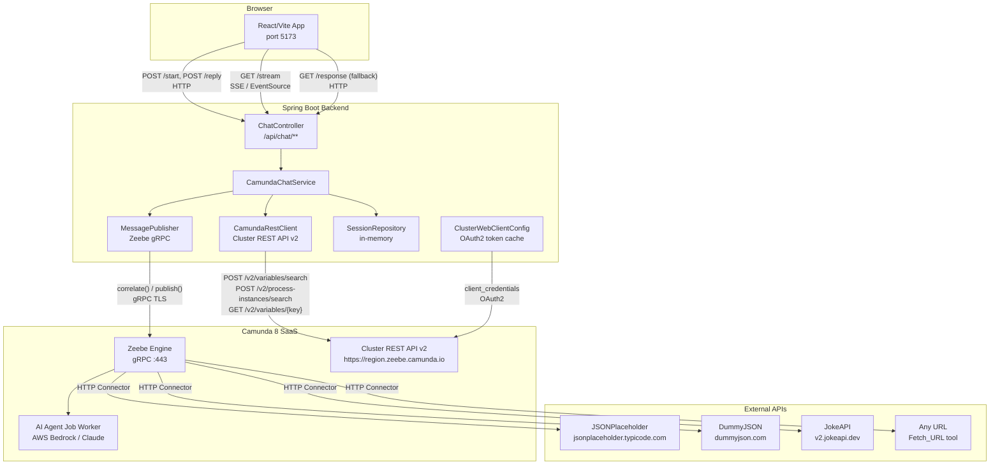

### Communication Protocols Summary

| Link | Protocol | Detail |
|------|----------|--------|
| Frontend → Backend (HTTP) | HTTP/1.1 over TCP | REST JSON, port 8081 |
| Frontend → Backend (SSE) | HTTP/1.1, `text/event-stream` | `EventSource` persistent connection |
| Backend → Zeebe | gRPC over TLS | Port 443, `grpcs://` address |
| Backend → Cluster REST API | HTTPS | Bearer token (OAuth2), WebFlux `WebClient` |
| Backend → Auth Server | HTTPS | `client_credentials` grant, form-encoded |
| Camunda → External APIs | HTTPS | HTTP JSON Connector (`io.camunda:http-json:1`) |

---

## 3. BPMN Process Design

### 3.1 Two Process Architectures

The repository contains two distinct BPMN implementations of the same business logic. Both share the same message names and variable contracts.

#### Architecture A — Monolithic (`ai-agent-chat-with-tools.bpmn`)

All four AI agent subprocesses are embedded as **Ad-Hoc SubProcesses** directly inside the single main process. Suitable for self-contained deployment where everything deploys as one unit.

- **Process ID:** `ai-agent-chat-with-tools`
- **Version Tag:** 3.2

#### Architecture B — Modular (`files/main-chat-router.bpmn` + 4 child processes)

The main router delegates to four separate deployed processes via **Call Activities**. Each agent is an independent process definition that can be versioned, deployed, and tested in isolation.

- **Router Process ID:** `ai-agent-chat-router`
- **Version Tag:** 1.0
- **Child processes:** `ai-agent-user-data`, `ai-agent-content`, `ai-agent-utility`, `ai-agent-general`

### 3.2 Main Process Flow

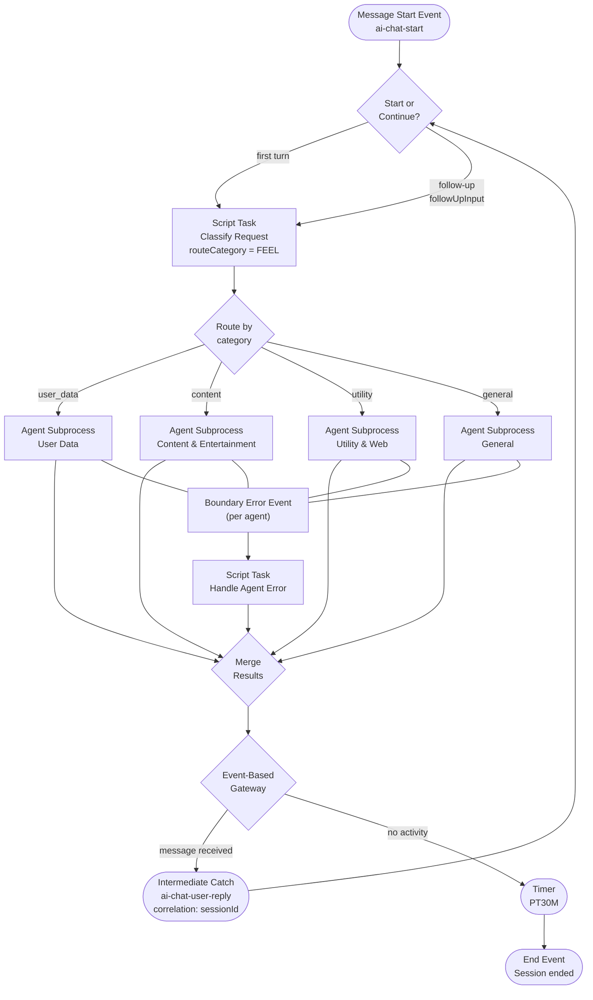

### 3.3 BPMN Elements Reference

#### Main Process (`ai-agent-chat-with-tools` / `ai-agent-chat-router`)

| Type | Name | ID | Purpose |
|------|------|----|---------|
| Message Start Event | Chat session started | `StartEvent_ChatSessionStarted` | Triggered by `ai-chat-start` message |
| Exclusive Gateway | Start / continue | `Gateway_StartOrContinue` | First turn vs follow-up routing |
| Script Task | Classify Request | `ClassifyRequest` | FEEL expression sets `routeCategory` |
| Exclusive Gateway | Route by category | `Gateway_RouteByCategory` | Fan-out to agent |
| Ad-Hoc SubProcess / Call Activity | User Data Agent | `UserData_Agent` / `Call_UserData` | Handles user data queries |
| Ad-Hoc SubProcess / Call Activity | Content & Entertainment Agent | `Content_Agent` / `Call_Content` | Handles recipes, jokes |
| Ad-Hoc SubProcess / Call Activity | Utility & Web Agent | `Utility_Agent` / `Call_Utility` | Date/time, math, URL fetch |
| Ad-Hoc SubProcess / Call Activity | General Agent | `General_Agent` / `Call_General` | Knowledge answers |
| Boundary Error Event | Agent error | `Error_*` | Catches errors per agent |
| Script Task | Handle Agent Error | `HandleAgentError` | Formats error response in `agent` variable |
| Exclusive Gateway | Merge results | `Gateway_MergeResults` | Re-joins all paths |
| Event-Based Gateway | Wait for user or timeout | `EventGateway_Wait` | Waits for reply or inactivity |
| Intermediate Message Catch | User sends next message | `MessageCatchEvent_UserReply` | `ai-chat-user-reply`, key: `sessionId` |
| Intermediate Timer Catch | 30 min inactivity | `TimerEvent_Timeout` | `PT30M` ISO duration |
| End Event | Session ended (inactivity) | `EndEvent_Timeout` | Terminal state |

#### Modular Architecture — Additional Elements

| Type | Name | Called Process |
|------|------|----------------|
| Script Task | Set Provider Config | Sets `providerConfig` (AI model, region, authType) |
| Call Activity | User Data Agent | `ai-agent-user-data` |
| Call Activity | Content & Entertainment Agent | `ai-agent-content` |
| Call Activity | Utility & Web Agent | `ai-agent-utility` |
| Call Activity | General Agent | `ai-agent-general` |

### 3.4 Agent Tools

#### User Data Agent (`ai-agent-user-data`)

| Task | Connector | Endpoint | Method | Purpose |
|------|-----------|----------|--------|---------|
| ListUsers | `io.camunda:http-json:1` | `https://jsonplaceholder.typicode.com/users` | GET | Fetch all users |
| LoadUserByID | `io.camunda:http-json:1` | `https://jsonplaceholder.typicode.com/users/{id}` | GET | Fetch single user |

#### Content & Entertainment Agent (`ai-agent-content`)

| Task | Connector | Endpoint | Method | Purpose |
|------|-----------|----------|--------|---------|
| Search_Recipe | `io.camunda:http-json:1` | `https://dummyjson.com/recipes/search?q={q}` | GET | Search recipes |
| Jokes_API | `io.camunda:http-json:1` | `https://v2.jokeapi.dev/joke/Any?format=txt&safe-mode` | GET | Fetch a safe joke |

#### Utility & Web Agent (`ai-agent-utility`)

| Task | Connector / Type | Expression / Endpoint | Purpose |
|------|------------------|-----------------------|---------|
| GetDateAndTime | Script Task (FEEL) | `=now()` → `toolCallResult` | Current date and time |
| SuperfluxProduct | Script Task (FEEL) | `=3 * (inputA + inputB)` | Custom math operation |
| Fetch_URL | `io.camunda:http-json:1` | Dynamic URL from AI | Fetch arbitrary web content |

#### General Agent (`ai-agent-general`)

| Task | Type | Purpose |
|------|------|---------|
| KnowledgeAnswer | Script Task | Returns AI knowledge-only answer (no external tool call) |

### 3.5 BPMN Variables

| Variable | Direction | Set By | Consumed By |
|----------|-----------|--------|-------------|
| `sessionId` | Input | Backend (`startSession`) | Message correlation key for replies |
| `inputText` | Input | Backend (`startSession`) | First user message |
| `followUpInput` | Input | Backend (`sendReply`) | Subsequent user messages |
| `inputDocuments` | Input | Backend | Document attachments (currently empty list) |
| `followUpDocuments` | Input | Backend | Follow-up attachments (currently empty list) |
| `currentInput` | Internal | ClassifyRequest script | Unified input for the current turn |
| `routeCategory` | Internal | ClassifyRequest script | `user_data`, `content`, `utility`, or `general` |
| `providerConfig` | Internal | SetProviderConfig script | AI model configuration (modular only) |
| `agent` | Output | Agent subprocess | `{ responseText, ... }` — read by backend |
| `toolCallResults` | Internal | Agent subprocess | Results from tool calls |
| `agentContext` | Internal | Agent subprocess | Conversation history for multi-turn AI |

---

## 4. Backend Architecture

### 4.1 Package Dependency Diagram

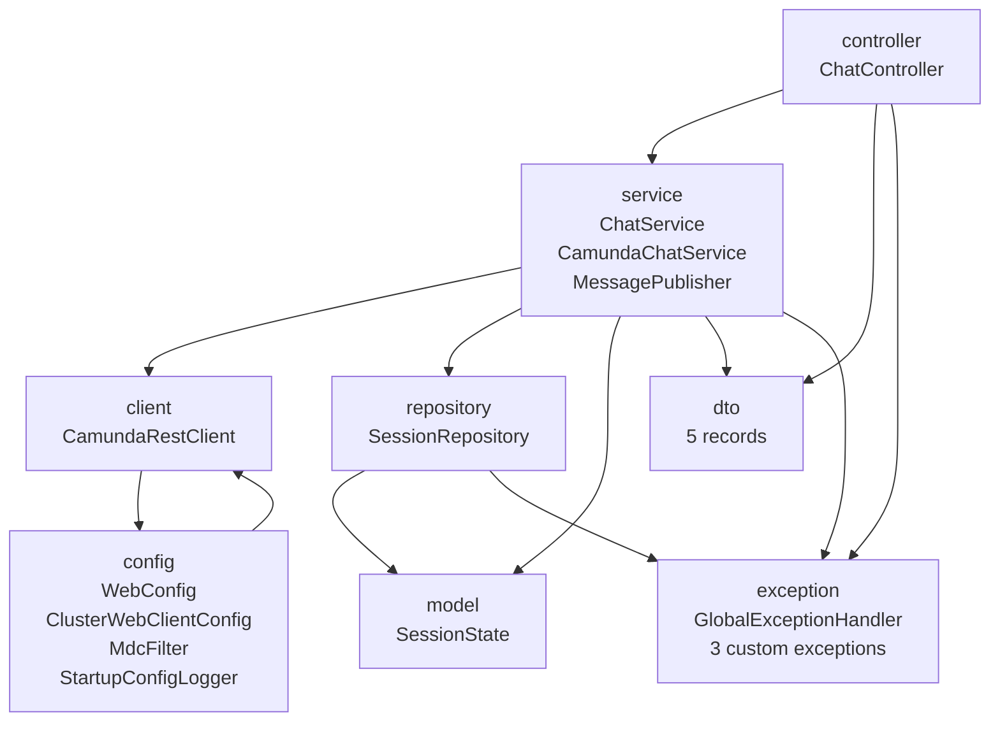

### 4.2 Package Responsibilities

| Package | Classes | Responsibility |
|---------|---------|----------------|
| `com.example.aichat` | `CamundaChatApplication` | Spring Boot entry point; enables scheduling |
| `com.example.aichat.controller` | `ChatController` | HTTP entry points; input validation; delegates to `ChatService` |
| `com.example.aichat.service` | `ChatService`, `CamundaChatService`, `MessagePublisher` | Business logic; Zeebe message operations; SSE streaming |
| `com.example.aichat.client` | `CamundaRestClient` | Camunda Cluster REST API v2 calls; variable resolution |
| `com.example.aichat.repository` | `SessionRepository` | In-memory session store; scheduled expiry cleanup |
| `com.example.aichat.model` | `SessionState` | Mutable, thread-safe chat session state |
| `com.example.aichat.dto` | 5 records | Immutable request/response contracts |
| `com.example.aichat.exception` | `GlobalExceptionHandler`, 3 custom exceptions | Centralized exception-to-HTTP mapping |
| `com.example.aichat.config` | `WebConfig`, `ClusterWebClientConfig`, `MdcFilter`, `StartupConfigLogger` | Cross-cutting concerns: CORS, OAuth2, MDC, logging |

---

## 5. Backend Component Details

### 5.1 ChatController

`@Validated @RestController @RequestMapping("/api/chat")`

| Method | Path | Request Body | Response Body | Success | Notes |
|--------|------|--------------|---------------|---------|-------|
| POST | `/start` | `StartChatRequest` | `StartChatResponse` | 200 | Starts new session; correlates start message |
| GET | `/{sessionId}/response` | — | `ChatResponseDTO` | 200 | Fallback polling endpoint |
| POST | `/{sessionId}/reply` | `ReplyRequest` | — | 200 | Publishes follow-up message |
| GET | `/{sessionId}/stream` | — | SSE stream of `ChatResponseDTO` events | 200 | Primary response channel |

All `{sessionId}` path variables are validated with `@NotBlank`. Request bodies are validated with `@Valid`.

### 5.2 ChatService Interface

```
ChatService
├── startSession(inputText) → SessionState
├── getResponse(sessionId) → ChatResponseDTO
├── sendReply(sessionId, followUpInput) → void
└── streamResponse(sessionId) → SseEmitter
```

Follows the **Dependency Inversion Principle** — `ChatController` depends on the interface, not the concrete implementation.

### 5.3 CamundaChatService

`@Service` implementing `ChatService`. Core business logic class.

#### `startSession(String inputText)`

1. Generates a random UUID as `sessionId`.
2. Builds variables map: `sessionId`, `inputText`, `inputDocuments` (empty list).
3. Calls `messagePublisher.correlate("ai-chat-start", "", variables)` — synchronous gRPC call that returns `processInstanceKey`.
4. Constructs and persists a new `SessionState` with the returned key.
5. Returns the `SessionState` (sessionId + processInstanceKey exposed to frontend).

#### `getResponse(String sessionId)`

Reads current process state from Camunda and translates it to a `ChatResponseDTO`:

1. Validates and retrieves `SessionState` from `SessionRepository`.
2. Calls `restClient.fetchProcessInstanceVariables(processInstanceKey)`.
3. If variables are **empty**: increments empty poll counter; after 60 consecutive empties, checks if process is in a terminal state (`COMPLETED`/`CANCELED`); if terminal, throws `SessionExpiredException`.
4. If variables are **present**: extracts `routeCategory` and `agent.responseText`; calls `session.checkAndAcceptNewResponse()` to atomically detect a new response.
5. Returns status `"ready"` with response, or `"processing"` if still waiting.
6. On 3+ consecutive REST errors: returns status `"error"`.

#### `sendReply(String sessionId, String followUpInput)`

1. Validates session.
2. Calls `messagePublisher.publish("ai-chat-user-reply", sessionId, variables)` — `sessionId` is the correlation key.
3. Sets `session.awaitingResponse = true` (also resets empty poll counter).
4. On publish failure: checks if process is terminal; throws `SessionExpiredException` if so, otherwise re-throws.

#### `streamResponse(String sessionId)`

1. Validates session exists.
2. Creates a `SseEmitter` with a 10-minute timeout.
3. Schedules a `Runnable` with `scheduleWithFixedDelay(runnable, 0, 1, SECONDS)` on a `ScheduledThreadPoolExecutor` sized to `availableProcessors()`.
4. Each scheduled execution calls `getResponse()` and sends the result as a JSON SSE event.
5. On terminal status (`"ready"` or `"error"`): completes the emitter, which cancels the scheduled future via the `onCompletion` callback.
6. On `SessionExpiredException`: sends a final `expired` event, then completes the emitter.
7. On `IOException` (client disconnected): completes with error.

### 5.4 MessagePublisher

`@Component` — single point for all Zeebe message operations.

| Method | Zeebe Command | Correlation Key | TTL | Returns | Used For |
|--------|---------------|-----------------|-----|---------|----------|
| `publish()` | `newPublishMessageCommand()` | `sessionId` | 30s | void | Follow-up replies to intermediate catch events |
| `correlate()` | `newCorrelateMessageCommand()` | `""` (empty) | — | `long processInstanceKey` | Start message — synchronous, strongly consistent |

**`publish()` vs `correlate()`:** `publish()` buffers the message in Zeebe for the TTL duration if no subscription exists yet. `correlate()` requires an active subscription and fails immediately if none exists — this is correct for start events since the process is guaranteed to have a waiting message start event when deployed. `correlate()` returns the `processInstanceKey` synchronously, eliminating the need for subsequent polling to find the started instance.

### 5.5 CamundaRestClient

`@Component` — all Camunda Cluster REST API v2 HTTP calls.

#### Camunda API Calls

| Method | HTTP | Endpoint | Purpose |
|--------|------|----------|---------|
| `fetchProcessInstanceVariables()` | POST | `/v2/variables/search` | Fetch all variables for a process instance |
| `searchProcessInstances()` | POST | `/v2/process-instances/search` | Filter process instances by state/key |
| `isProcessInstanceInState()` | POST | `/v2/process-instances/search` (×N states) | Check if instance is COMPLETED or CANCELED |
| `fetchFullVariableValue()` (private) | GET | `/v2/variables/{variableKey}` | Fetch full (non-truncated) variable value |

#### Variable Resolution Logic

Camunda's variables API may return truncated values for large variables. `CamundaRestClient` handles this transparently:

1. Checks `isTruncated` flag on each variable node.
2. If truncated: fetches the full value via `GET /v2/variables/{variableKey}`.
3. Prefers `fullValue` field over `value` field when present.
4. Parses string values as JSON where possible (for nested objects like `agent`).

All requests use a 10-second block timeout via Reactor's `Mono.block()`.

### 5.6 ClusterWebClientConfig

`@Configuration` — produces the `clusterWebClient` Spring bean.

- Builds a `WebClient` with `clusterApiUrl` as base URL and a Netty `HttpClient` with:
  - Response timeout: 10 seconds
  - Connection timeout: 5 seconds
- Attaches an `ExchangeFilterFunction` that injects a Bearer token before every request.

#### OAuth2 Token Management

```
getAccessToken() [synchronized]
├── Token cached and not expired? → return cached token
└── Expired or absent
    ├── POST {authTokenUrl}
    │   Content-Type: application/x-www-form-urlencoded
    │   Body: grant_type=client_credentials
    │         client_id={clientId}
    │         client_secret={clientSecret}
    │         audience=zeebe.camunda.io
    ├── Cache access_token
    └── Set expiry = now() + expires_in - 60s (60s safety buffer)
```

Token caching is synchronized on the `ClusterWebClientConfig` instance. The 60-second buffer ensures the token is refreshed before it actually expires.

### 5.7 SessionRepository

`@Repository` — in-memory `ConcurrentHashMap<String, SessionState>`.

| Operation | Method | Behavior |
|-----------|--------|----------|
| Store session | `save(SessionState)` | Puts by `sessionId` key |
| Retrieve active | `getActiveSession(String)` | Returns session; throws `SessionNotFoundException` if absent; throws `SessionExpiredException` if `session.isExpired()` |
| Cleanup | `cleanupExpiredSessions()` | `@Scheduled` every 5 minutes; removes entries where `isExpired() == true` OR `createdAt` is before the max-age cutoff |

Sessions are never evicted mid-stream; they age out naturally 30 minutes after creation or are explicitly marked expired by `CamundaChatService`.

### 5.8 SessionState

Mutable, thread-safe domain model. All state-mutating methods are `synchronized`.

| Field | Type | Initial Value | Purpose |
|-------|------|---------------|---------|
| `sessionId` | String | UUID | Unique session identifier |
| `processInstanceKey` | String | From `correlate()` | Links session to Camunda process instance |
| `createdAt` | Instant | `Instant.now()` | Used for max-age cleanup |
| `awaitingResponse` | boolean | `true` | Tracks whether a new AI response is expected |
| `lastResponseText` | String | null | Last confirmed AI response text |
| `lastHandledBy` | String | null | Agent label for last response |
| `consecutiveEmptyPolls` | int | 0 | Reset on any variable data; triggers expiry check at threshold |
| `consecutiveErrors` | int | 0 | Reset on success; triggers error response at 3 |
| `expired` | boolean | false | Set on process termination |

#### `checkAndAcceptNewResponse(currentResponseText, handledBy)` — Atomic Detection

This synchronized method prevents duplicate response delivery:

1. Returns `null` if `currentResponseText` is blank.
2. Returns `null` if `awaitingResponse == false` (response already delivered for this turn).
3. Returns `currentResponseText` only if it differs from `lastResponseText` (new response detected).
4. On detection: updates `lastResponseText`, `lastHandledBy`, sets `awaitingResponse = false`, resets `consecutiveEmptyPolls`.

### 5.9 GlobalExceptionHandler

`@RestControllerAdvice` — maps all exceptions to structured JSON error responses.

| Exception | HTTP Status | Error Code |
|-----------|-------------|------------|
| `SessionNotFoundException` | 404 Not Found | `session_not_found` |
| `SessionExpiredException` | 410 Gone | `session_expired` |
| `ProcessStartException` | 503 Service Unavailable | `process_start_failed` |
| `MethodArgumentNotValidException` | 400 Bad Request | `validation_error` |
| `ConstraintViolationException` | 400 Bad Request | `validation_error` |
| `IllegalArgumentException` | 400 Bad Request | `invalid_request` |
| `HttpMessageNotReadableException` | 400 Bad Request | `invalid_request` |
| `MethodArgumentTypeMismatchException` | 400 Bad Request | `invalid_request` |
| `WebClientResponseException` | 502 Bad Gateway | `upstream_error` |
| `RuntimeException` | 500 Internal Server Error | `internal_error` |
| `Exception` | 500 Internal Server Error | `internal_error` |

All responses use `ErrorResponse(String error, String message)`.

### 5.10 MdcFilter

`@Component @Order(HIGHEST_PRECEDENCE)` extending `OncePerRequestFilter`.

For every HTTP request:
1. Generates a random 8-character `requestId` and puts it in MDC.
2. Extracts `sessionId` from path `/api/chat/{sessionId}` (if segment is not `"start"`) and puts it in MDC.
3. Sets security response headers: `X-Content-Type-Options: nosniff`, `X-Frame-Options: DENY`, `Cache-Control: no-store`.
4. Clears MDC in `finally` block after the filter chain completes.

MDC values appear in all log lines within the request thread, enabling easy log correlation by `requestId` and `sessionId`.

### 5.11 DTOs

All DTOs are Java records (immutable).

| Record | Fields | Validation |
|--------|--------|------------|
| `StartChatRequest` | `inputText` | `@NotBlank`, `@Size(max=4000)` |
| `StartChatResponse` | `sessionId`, `processInstanceKey` | — |
| `ReplyRequest` | `followUpInput` | `@NotBlank`, `@Size(max=4000)` |
| `ChatResponseDTO` | `status`, `responseText`, `handledBy` | — |
| `ErrorResponse` | `error`, `message` | — |

#### ChatResponseDTO Status Values

| Status | Meaning | `responseText` |
|--------|---------|----------------|
| `processing` | Camunda process is still running | null |
| `ready` | AI response available | The response text |
| `error` | Persistent error after 3 retries | Error description |
| `expired` | Process instance completed/timed out | `"Session expired."` |

---

## 6. Chat Session Lifecycle

### 6.1 Full Happy-Path Sequence

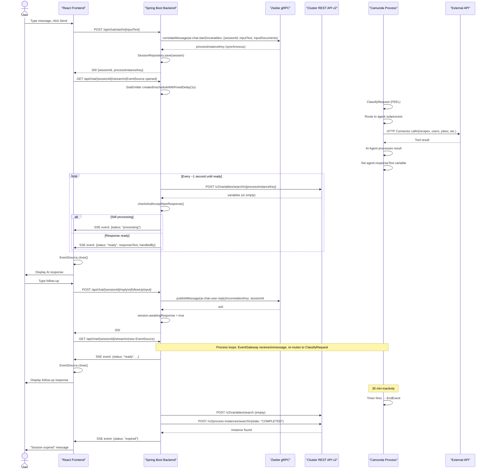

---

## 7. Server-Sent Events Flow

### 7.1 SSE Architecture

SSE is the primary channel for delivering AI responses to the browser. The backend creates a long-lived HTTP connection and pushes JSON events whenever the process state changes.

### 7.2 Backend SSE Lifecycle

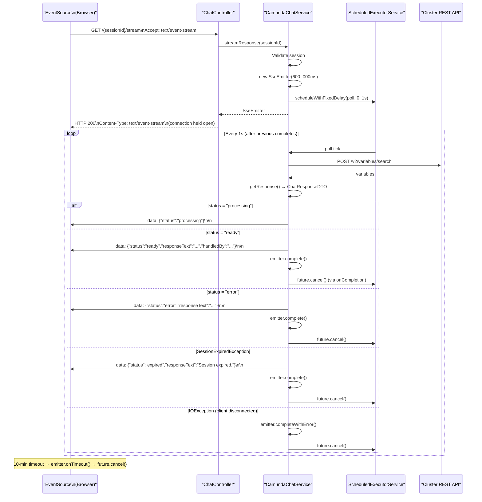

### 7.3 Frontend EventSource Lifecycle

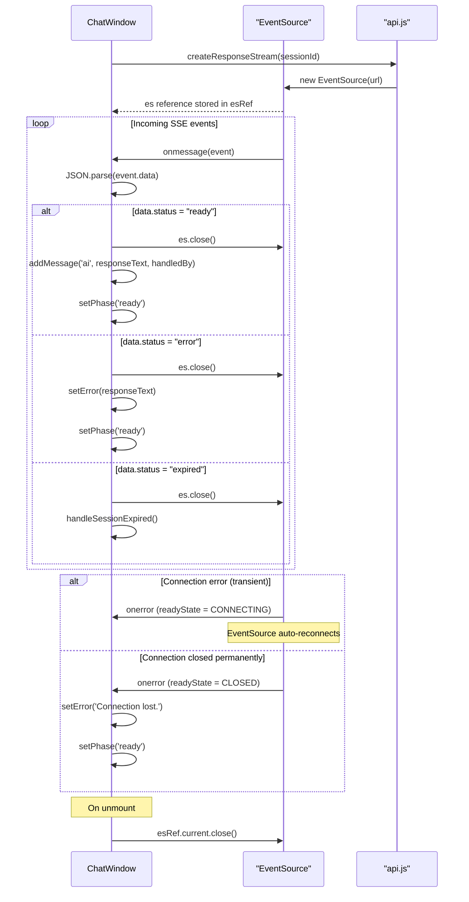

### 7.4 SSE Event Format

Each SSE event sent by the backend:

```
data: {"status":"processing","responseText":null,"handledBy":null}

data: {"status":"ready","responseText":"Here are the users: ...","handledBy":"User Data Agent"}

data: {"status":"error","responseText":"Unable to retrieve response. Please try again.","handledBy":null}

data: {"status":"expired","responseText":"Session expired.","handledBy":null}
```

Each event is a single `data:` line followed by two newlines (`\n\n`), conforming to the SSE specification.

---

## 8. Message Correlation Flow

### 8.1 Start Message — `correlate()` (Synchronous)

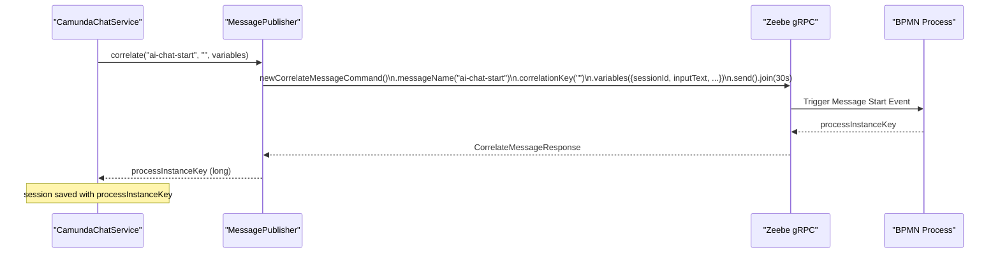

**Why `correlate()` for start:** The Zeebe `newCorrelateMessageCommand` is synchronous and returns the `processInstanceKey` directly. This eliminates the need to poll the process instance search API after startup. If no matching message start event subscription exists (process not deployed), the call fails immediately with a clear error rather than timing out silently.

**Why empty correlation key `""`:** Message start events do not correlate to a running instance; they create one. The correlation key is irrelevant for start events and is passed as an empty string.

### 8.2 Reply Message — `publish()` (Buffered)

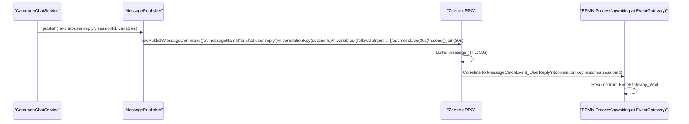

**Why `publish()` for replies:** The intermediate message catch event may not yet be active when the reply arrives (the process may still be completing its previous response cycle). `publish()` buffers the message in Zeebe for up to the TTL (30 seconds), ensuring it is delivered when the catch event becomes active.

---

## 9. Authentication and Security

### 9.1 OAuth2 Client Credentials Flow

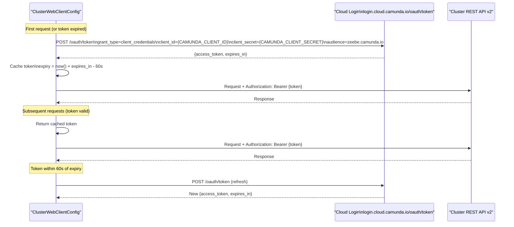

The token fetch and caching in `getAccessToken()` are `synchronized`, making it safe for concurrent requests from multiple SSE poll threads.

### 9.2 CORS Configuration

Managed by `WebConfig`:

```
Mapping:      /api/**
Origins:      http://localhost:5173, http://127.0.0.1:5173
Methods:      GET, POST, OPTIONS
Headers:      Content-Type, Accept, X-Requested-With, Last-Event-ID
Credentials:  false
```

`Last-Event-ID` is included because browsers send this header automatically when an `EventSource` reconnects after a connection drop, allowing the server to resume from the last event (future capability).

### 9.3 Security Headers

Set by `MdcFilter` on every response:

| Header | Value | Purpose |
|--------|-------|---------|
| `X-Content-Type-Options` | `nosniff` | Prevents MIME-type sniffing |
| `X-Frame-Options` | `DENY` | Prevents clickjacking via iframes |
| `Cache-Control` | `no-store` | Prevents sensitive API responses from being cached |

### 9.4 Request Tracing with MDC

`MdcFilter` injects two values into SLF4J MDC before each request:

- **`requestId`**: A random 8-character UUID prefix — unique per HTTP request.
- **`sessionId`**: Extracted from the URL path `/api/chat/{sessionId}` when applicable.

These appear in every log line for the duration of that request thread:

```
14:23:01.456 [http-nio-8081-exec-3] INFO  [a1b2c3d4] [sess-uuid-here] c.e.a.s.CamundaChatService - Correlated ai-chat-start ...
```

---

## 10. Frontend Architecture

### 10.1 Component Tree

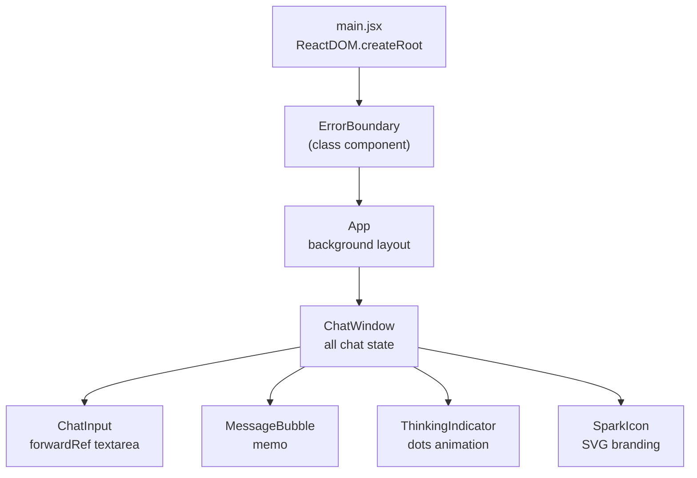

### 10.2 ChatWindow State Machine

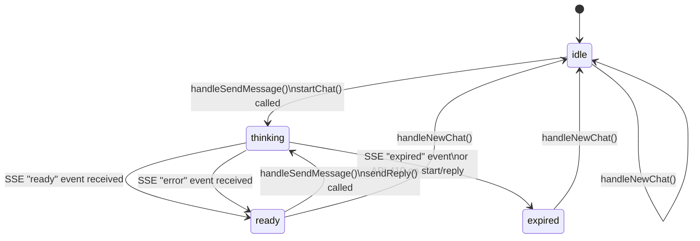

| Phase | UI Shown | Input Enabled |
|-------|----------|---------------|
| `idle` | Empty state, quick prompts | Yes |
| `thinking` | `ThinkingIndicator`, "working..." hint | No |
| `ready` | AI message bubble | Yes (for follow-up) |
| `expired` | System message, "Start new conversation" | No |

### 10.3 ChatWindow Key Logic

| Function | Trigger | Action |
|----------|---------|--------|
| `handleSendMessage(text)` | User submits input | If no session: `startChat()` then `startStreaming()`; if session: `sendReply()` then `startStreaming()` |
| `startStreaming(sid)` | After start or reply | Calls `stopStreaming()`, creates `EventSource`, stores in `esRef`, registers `onmessage`/`onerror` |
| `stopStreaming()` | On terminal SSE event, new chat, component unmount | Closes `EventSource`, nulls `esRef` |
| `handleSessionExpired()` | 410 error or `expired` SSE status | Calls `stopStreaming()`, sets phase `expired`, adds system message |
| `handleNewChat()` | New Chat button | Calls `stopStreaming()`, resets all state to initial values |
| `addMessage(role, text, handledBy)` | On AI response, user send, system event | Appends `{id, role, text, timestamp, handledBy}` to `messages` array |

### 10.4 MessageBubble

Renders differently by `role`:

| Role | Rendering | Special Processing |
|------|-----------|-------------------|
| `user` | Plain text, right-aligned bubble | None |
| `ai` | `react-markdown` with `remark-gfm` | Strips `<thinking>...</thinking>` tags; links open `target="_blank"` |
| `system` | Italic centered text | None |

The `handledBy` label (agent name) appears as a small badge below AI messages.

### 10.5 API Module (`api.js`)

| Export | Type | Purpose |
|--------|------|---------|
| `startChat(inputText)` | async function | POST `/start` |
| `getResponse(sessionId)` | async function | GET `/{sessionId}/response` (fallback) |
| `sendReply(sessionId, followUpInput)` | async function | POST `/{sessionId}/reply` |
| `createResponseStream(sessionId)` | function | Returns `new EventSource(...)` for SSE |
| `ApiError` | class | Custom error: `status`, `errorCode`, `message` |

All HTTP functions use `fetchWithTimeout()` with a 15-second `AbortController` timeout. Network errors and timeouts are normalized into `ApiError` instances.

---

## 11. REST API Reference

### Base URL

```
http://localhost:8081/api/chat
```

Configurable via `VITE_API_BASE` environment variable on the frontend.

---

### POST `/api/chat/start`

Starts a new chat session. Correlates the `ai-chat-start` Zeebe message, which triggers the BPMN Message Start Event and returns the process instance key synchronously.

**Request**

```json
{ "inputText": "Tell me a joke" }
```

| Field | Type | Constraints |
|-------|------|-------------|
| `inputText` | string | Required, not blank, max 4000 chars |

**Response — 200 OK**

```json
{ "sessionId": "550e8400-e29b-41d4-a716-446655440000", "processInstanceKey": "2251799813685324" }
```

**Error Responses**

| Status | Error Code | Cause |
|--------|------------|-------|
| 400 | `validation_error` | Blank or missing `inputText` |
| 503 | `process_start_failed` | Zeebe correlation failed (process not deployed, network error) |

---

### GET `/api/chat/{sessionId}/response`

Fallback polling endpoint. Returns current process state as a single snapshot.

**Response — 200 OK**

```json
{ "status": "processing", "responseText": null, "handledBy": null }
```

```json
{ "status": "ready", "responseText": "Why did the scarecrow win an award?...", "handledBy": "Content & Entertainment Agent" }
```

**Error Responses**

| Status | Error Code | Cause |
|--------|------------|-------|
| 400 | `validation_error` | Blank `sessionId` |
| 404 | `session_not_found` | Unknown session ID |
| 410 | `session_expired` | Process completed or timed out |

---

### POST `/api/chat/{sessionId}/reply`

Sends a follow-up message to an active session. Publishes the `ai-chat-user-reply` message to Zeebe, correlated by `sessionId`.

**Request**

```json
{ "followUpInput": "Can you tell me another one?" }
```

| Field | Type | Constraints |
|-------|------|-------------|
| `followUpInput` | string | Required, not blank, max 4000 chars |

**Response — 200 OK** — empty body.

**Error Responses**

| Status | Error Code | Cause |
|--------|------------|-------|
| 400 | `validation_error` | Blank or missing `followUpInput` |
| 404 | `session_not_found` | Unknown session ID |
| 410 | `session_expired` | Process already completed |
| 500 | `internal_error` | Zeebe publish failed |

---

### GET `/api/chat/{sessionId}/stream`

Primary response channel. Opens a Server-Sent Events stream. The backend polls Camunda every ~1 second and pushes a `ChatResponseDTO` JSON payload as each SSE data event. The stream closes automatically when a terminal status is emitted.

**Response** — `Content-Type: text/event-stream`

```
data: {"status":"processing","responseText":null,"handledBy":null}

data: {"status":"ready","responseText":"Here are all users: ...","handledBy":"User Data Agent"}

```

**Terminal statuses** (stream closes after sending): `ready`, `error`, `expired`.

**Error Responses** (before stream opens)

| Status | Error Code | Cause |
|--------|------------|-------|
| 404 | `session_not_found` | Unknown session ID |
| 410 | `session_expired` | Session already expired |

---

### Error Response Schema

All error responses share the same structure:

```json
{ "error": "error_code", "message": "Human-readable description" }
```

---

## 12. Error Handling

### 12.1 Backend Exception Mapping

| Exception | Thrown By | HTTP | Error Code | Logged |
|-----------|-----------|------|------------|--------|
| `SessionNotFoundException` | `SessionRepository.getActiveSession()` | 404 | `session_not_found` | No |
| `SessionExpiredException` | `SessionRepository`, `CamundaChatService` | 410 | `session_expired` | No |
| `ProcessStartException` | `CamundaChatService.startSession()` | 503 | `process_start_failed` | ERROR |
| `MethodArgumentNotValidException` | Spring validation | 400 | `validation_error` | No |
| `ConstraintViolationException` | Spring validation | 400 | `validation_error` | No |
| `IllegalArgumentException` | — | 400 | `invalid_request` | No |
| `HttpMessageNotReadableException` | Jackson | 400 | `invalid_request` | No |
| `MethodArgumentTypeMismatchException` | Spring MVC | 400 | `invalid_request` | No |
| `WebClientResponseException` | `CamundaRestClient` | 502 | `upstream_error` | ERROR |
| `RuntimeException` | Any | 500 | `internal_error` | ERROR |
| `Exception` | Any | 500 | `internal_error` | ERROR |

### 12.2 Frontend Error Handling

**`ApiError` class** — thrown by `fetchWithTimeout()` and `handleResponse()`:

| Scenario | `status` | `errorCode` |
|----------|----------|-------------|
| HTTP 4xx/5xx | HTTP status code | From response body `error` field |
| Request timeout | 0 | `timeout` |
| Network error | 0 | `network_error` |

**`isSessionGone(err)`** — returns `true` if `errorCode === 'session_expired'` or `status === 410`. When true, `handleSessionExpired()` is called rather than showing a generic error.

**Error Banner** — displayed for transient errors (failed send, backend down, connection lost). Dismissible by the user. SSE connection errors (`onerror` when `CLOSED`) set the error banner.

**`ErrorBoundary`** — class component wrapping the entire app. Catches unhandled React render errors and shows a retry fallback UI, preventing a blank screen.

### 12.3 SSE Error Resilience

- **Transient network drop**: `EventSource` auto-reconnects (browser built-in). The backend stream is still running; the frontend will receive the next push event.
- **Permanent disconnect** (`readyState === CLOSED`): `onerror` handler shows "Connection lost" and sets phase to `ready`, allowing the user to retry.
- **Backend SSE poll error (non-IOException)**: `completeWithError()` is called, which triggers `onerror` in the browser.
- **Consecutive REST errors (≥3)**: `getResponse()` returns `status: "error"`, which terminates the SSE stream gracefully with an informative message.

---

## 13. Configuration Reference

### 13.1 Backend (`application.yaml`)

| Property | Value / Default | Description |
|----------|-----------------|-------------|
| `camunda.client.mode` | `saas` | Camunda client mode |
| `camunda.client.auth.client-id` | `${CAMUNDA_CLIENT_ID}` | Zeebe client ID |
| `camunda.client.auth.client-secret` | `${CAMUNDA_CLIENT_SECRET}` | Zeebe client secret |
| `camunda.client.auth.token-url` | `https://login.cloud.camunda.io/oauth/token` | OAuth2 token endpoint |
| `camunda.client.grpc-address` | `grpcs://{clusterId}.{region}.zeebe.camunda.io:443` | Zeebe gRPC address |
| `camunda.client.rest-address` | `https://{region}.zeebe.camunda.io/{clusterId}` | Zeebe REST address |
| `camunda.client.cloud.cluster-id` | `${CAMUNDA_CLIENT_CLOUD_CLUSTERID}` | Cluster ID |
| `camunda.client.cloud.region` | `${CAMUNDA_CLIENT_CLOUD_REGION}` | Cluster region |
| `server.port` | `8081` | HTTP server port |
| `app.cors.allowed-origins` | `http://localhost:5173,http://127.0.0.1:5173` | CORS-allowed frontend origins |
| `app.camunda.cluster-api-url` | `https://{region}.zeebe.camunda.io/{clusterId}` | Base URL for Cluster REST API |
| `app.camunda.messages.start` | `ai-chat-start` | Zeebe message name for process start |
| `app.camunda.messages.reply` | `ai-chat-user-reply` | Zeebe message name for user replies |
| `app.camunda.messages.ttl-seconds` | `30` | TTL for published messages (seconds) |
| `app.polling.empty-polls-before-expiry-check` | `60` | Consecutive empty variable polls before checking process state |
| `app.session.max-age-minutes` | `30` | Session max age for cleanup |
| `app.session.cleanup-interval-ms` | `300000` | Session cleanup interval (5 minutes) |
| `logging.level.com.example.aichat` | `INFO` | Application log level |
| `logging.level.io.camunda` | `INFO` | Camunda SDK log level |

### 13.2 Backend Environment Variables

| Variable | Required | Description |
|----------|----------|-------------|
| `CAMUNDA_CLIENT_ID` | Yes | OAuth2 client ID for Camunda SaaS |
| `CAMUNDA_CLIENT_SECRET` | Yes | OAuth2 client secret |
| `CAMUNDA_CLIENT_CLOUD_CLUSTERID` | Yes | Camunda cluster ID |
| `CAMUNDA_CLIENT_CLOUD_REGION` | Yes | Camunda cluster region (e.g. `bru-2`) |

Variables are loaded from a `.env` file at the project root via the `springboot3-dotenv` dependency.

### 13.3 Frontend Environment Variables

| Variable | Default | Description |
|----------|---------|-------------|
| `VITE_API_BASE` | `http://localhost:8081/api/chat` | Backend API base URL |

Set in `.env` or `.env.local` at the `Frontend/` directory root for non-default environments.

### 13.4 Tech Stack Versions

| Component | Technology | Version |
|-----------|------------|---------|
| Backend runtime | Java | 21 |
| Backend framework | Spring Boot | 3.4.3 |
| Camunda SDK | camunda-spring-boot-starter | 8.8.0 |
| Reactive HTTP | Spring WebFlux / Reactor Netty | (from Spring Boot BOM) |
| Build tool | Maven | 3.x |
| Frontend framework | React | 18.3.1 |
| Build tool | Vite | 4.5.5 |
| Markdown rendering | react-markdown + remark-gfm | 10.1.0 + 4.0.1 |
| Testing (backend) | JUnit 5 + Mockito + MockMvc | (from Spring Boot BOM) |
| Testing (frontend) | Vitest + Testing Library | 0.34.6 + 14.x |

---

## 14. Testing

### 14.1 Backend Tests

#### `ChatControllerTest` (`@WebMvcTest`)

Tests the HTTP layer in isolation using `MockMvc` with a mocked `ChatService`.

| Test | Validates |
|------|-----------|
| `startChat_withValidBody_returns200` | Valid JSON body → 200, sessionId and processInstanceKey in response |
| `startChat_withBlankInputText_returns400` | Whitespace-only `inputText` → 400 |
| `startChat_withNullBody_returns400` | Missing `inputText` field → 400 |
| `getResponse_returns200WhenServiceReturnsProcessing` | `processing` status propagated correctly |
| `sendReply_withValidBody_returns200` | Valid reply body → 200 |
| `sendReply_withBlankFollowUpInput_returns400` | Whitespace-only `followUpInput` → 400 |

#### `SessionStateTest`

Unit tests for the domain model's state machine logic.

| Test | Validates |
|------|-----------|
| Constructor defaults | `awaitingResponse=true`, `expired=false`, counters at 0 |
| `checkAndAcceptNewResponse` — new response | Returns response text, clears `awaitingResponse` |
| `checkAndAcceptNewResponse` — same response | Returns null (no duplicate delivery) |
| `checkAndAcceptNewResponse` — not awaiting | Returns null |
| `incrementAndResetConsecutiveErrors` | Counter increment and reset to 0 |
| `incrementAndResetEmptyPolls` | Counter increment and reset to 0 |
| `setAwaitingResponseTrue_resetsEmptyPolls` | Setting `awaitingResponse=true` resets empty poll counter |

#### `SessionRepositoryTest`

Unit tests for session storage and cleanup.

| Test | Validates |
|------|-----------|
| `saveAndGetActiveSession_returnsSession` | Round-trip: save then retrieve |
| `getActiveSession_throwsSessionNotFoundForUnknownId` | Unknown ID → `SessionNotFoundException` |
| `getActiveSession_throwsSessionExpiredWhenMarkedExpired` | `isExpired=true` → `SessionExpiredException` |
| `cleanupExpiredSessions_removesOldSessions` | Aged-out sessions removed, fresh sessions retained |

### 14.2 Frontend Tests

#### `ChatInput.test.jsx`

| Test | Validates |
|------|-----------|
| Form submit | `onSend` called with correct text |
| Empty submit | `onSend` not called for empty input |
| Enter key | Submits on Enter, not on Shift+Enter |
| Disabled state | Input not submittable when `disabled=true` |

#### `MessageBubble.test.jsx`

| Test | Validates |
|------|-----------|
| User message | Correct bubble class and text |
| AI markdown | Markdown rendered (e.g. `**bold**` → `<strong>`) |
| System message | Correct styling class |
| `<thinking>` stripping | Tags and content removed from display |
| Link attributes | `target="_blank"` and `rel="noopener noreferrer"` present |

### 14.3 Running Tests

```bash
# Backend
cd Backend
mvn test

# Frontend
cd Frontend
npm test
```

---

## 15. Project Structure

```
AI Agent Chat With Tools/
├── DOCUMENTATION.md                    (this file)
├── ai agent chat with tools.bpmn       (Architecture A: monolithic process)
├── Webhook Message Start Event Connector.json
├── AI Agent SubProcess Extended.json
├── AI Agent SubProcess Extended - Final.json
│
├── files/                              (Architecture B: modular processes)
│   ├── main-chat-router.bpmn
│   ├── agent-user-data.bpmn
│   ├── agent-content.bpmn
│   ├── agent-utility.bpmn
│   └── agent-general.bpmn
│
├── Backend/
│   ├── pom.xml
│   └── src/
│       ├── main/
│       │   ├── java/com/example/aichat/
│       │   │   ├── CamundaChatApplication.java
│       │   │   ├── client/
│       │   │   │   └── CamundaRestClient.java
│       │   │   ├── config/
│       │   │   │   ├── ClusterWebClientConfig.java
│       │   │   │   ├── MdcFilter.java
│       │   │   │   ├── StartupConfigLogger.java
│       │   │   │   └── WebConfig.java
│       │   │   ├── controller/
│       │   │   │   └── ChatController.java
│       │   │   ├── dto/
│       │   │   │   ├── ChatResponseDTO.java
│       │   │   │   ├── ErrorResponse.java
│       │   │   │   ├── ReplyRequest.java
│       │   │   │   ├── StartChatRequest.java
│       │   │   │   └── StartChatResponse.java
│       │   │   ├── exception/
│       │   │   │   ├── GlobalExceptionHandler.java
│       │   │   │   ├── ProcessStartException.java
│       │   │   │   ├── SessionExpiredException.java
│       │   │   │   └── SessionNotFoundException.java
│       │   │   ├── model/
│       │   │   │   └── SessionState.java
│       │   │   ├── repository/
│       │   │   │   └── SessionRepository.java
│       │   │   └── service/
│       │   │       ├── CamundaChatService.java
│       │   │       ├── ChatService.java
│       │   │       └── MessagePublisher.java
│       │   └── resources/
│       │       └── application.yaml
│       └── test/
│           └── java/com/example/aichat/
│               ├── controller/
│               │   └── ChatControllerTest.java
│               ├── model/
│               │   └── SessionStateTest.java
│               └── repository/
│                   └── SessionRepositoryTest.java
│
└── Frontend/
    ├── package.json
    ├── vite.config.js
    ├── eslint.config.js
    ├── index.html
    └── src/
        ├── main.jsx
        ├── App.jsx
        ├── App.css
        ├── index.css
        ├── services/
        │   └── api.js
        ├── components/
        │   ├── ChatWindow.jsx
        │   ├── ChatWindow.css
        │   ├── ChatInput.jsx
        │   ├── ChatInput.css
        │   ├── MessageBubble.jsx
        │   ├── MessageBubble.css
        │   ├── ThinkingIndicator.jsx
        │   ├── ThinkingIndicator.css
        │   ├── ErrorBoundary.jsx
        │   ├── ErrorBoundary.css
        │   ├── SparkIcon.jsx
        │   └── __tests__/
        │       ├── ChatInput.test.jsx
        │       └── MessageBubble.test.jsx
        └── test/
            └── setup.js
```
